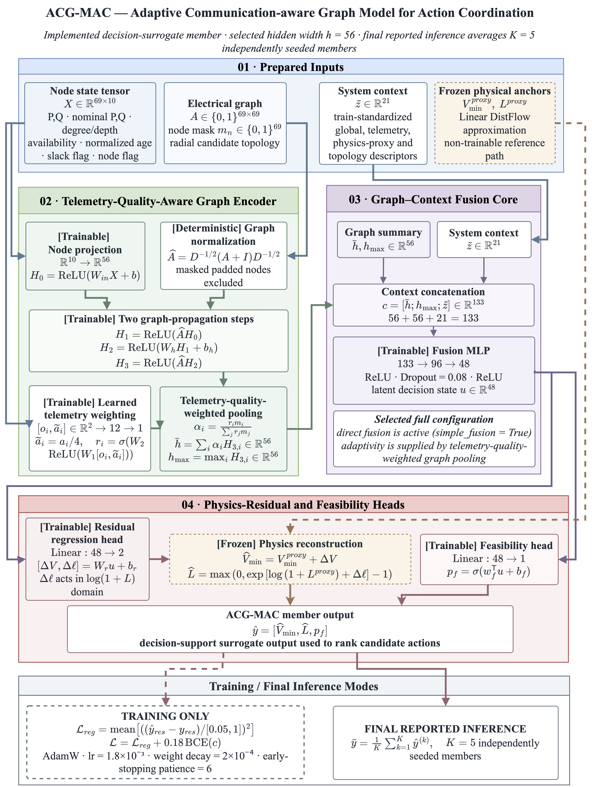
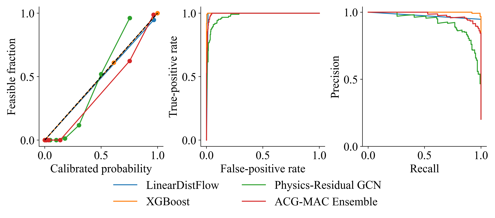

# ACG-MAC Grid Surrogate

**Graph-based network-state prediction and physics-verified action screening under incomplete telemetry.**

ACG-MAC predicts minimum voltage, active power loss and operating-state feasibility from network topology, electrical proxies and imperfect telemetry. This repository contains the simulation dataset, seven executable notebooks, their saved scientific outputs and the Python implementation. A learned surrogate ranks candidate topology/source-voltage actions; a radial power-flow calculation filters candidates and allows abstention.

[Start with the notebooks](notebooks/01_Data_and_Research_Design.ipynb) · [Numerical results](artifacts/README.md) · [Figure gallery](figures/README.md) · [Dataset](dataset/README.md)

## Model

The full model uses two graph-propagation layers, learned availability/age weights for mean pooling, unweighted max pooling, a graph–context fusion MLP, additive voltage and log-loss residuals around Linear DistFlow, and an auxiliary feasibility head. Hidden width is 56. The full configuration uses simple fusion; the optional adaptive context gate is inactive. The reported ensemble averages five fixed seeds (20260922–20260926).



The implementation is in [`src/models.py`](src/models.py), with the architecture also exposed in [Notebook 05](notebooks/05_Proposed_Model_and_Ablations.ipynb). The training protocol and fixed configurations are in [`src/protocol.py`](src/protocol.py).

## Experimental design

An observation is an independently sampled operating scenario. The primary benchmark uses a 33-bus feeder with 60 radial topologies; the external benchmark uses a 69-bus feeder.

| Subset | Scenarios | Independent topologies | Regression-eligible scenarios |
| --- | ---: | ---: | ---: |
| Training | 2,146 | 33 | 2,146 |
| Selection | 638 | 9 | 638 |
| Calibration | 598 | 9 | 598 |
| Test | 618 | 9 | 605 |
| External feeder | 800 | 1 | 800 |

Primary subsets are disjoint by topology. Three group folds are formed within training for out-of-fold evaluation. Statistical transformations are fitted on training data; graph early stopping uses an inner training-topology subset. Probability calibration and residual intervals use the calibration subset.

The test set was examined during model development, so it is not a blinded confirmatory evaluation. The 13 test scenarios without converged power-flow references are excluded from regression and retained as inadmissible in classification. Numerical nonconvergence does not establish physical infeasibility.

## Saved results

All models below use the same **605 converged test scenarios**. Lower RMSE and MAE are better. Full-precision values, R² and ranks are available in the [voltage](artifacts/voltage_metrics.csv) and [loss](artifacts/loss_metrics.csv) tables.

| Model | Voltage RMSE ↓ (p.u.) | Voltage MAE ↓ (p.u.) | Loss RMSE ↓ (kW) | Loss MAE ↓ (kW) |
| --- | ---: | ---: | ---: | ---: |
| LinearDistFlow | 0.020858 | 0.008972 | 132.2685 | 46.2150 |
| Ridge | 0.009549 | 0.003443 | 47.4943 | 20.8536 |
| RandomForest | 0.013573 | 0.004190 | 90.5162 | 19.8803 |
| ExtraTrees | 0.018995 | 0.005976 | 125.8692 | 32.3024 |
| MLP | 0.011701 | 0.005446 | 38.4285 | 14.3771 |
| XGBoost | 0.016909 | 0.004876 | 79.9516 | 17.5802 |
| LightGBM | 0.016672 | 0.004202 | 105.5868 | 21.5960 |
| GCN Direct | 0.023381 | 0.013531 | 88.4798 | 45.4152 |
| Physics-Residual GCN | 0.008909 | 0.003787 | 58.3301 | 15.7009 |
| ACG-MAC Ensemble | 0.006698 | 0.002405 | 48.7710 | 12.5596 |

ACG-MAC has the lowest voltage RMSE and loss MAE among these retained models. MLP has the lowest loss RMSE. Paired comparisons over the nine independent test topologies do not reach Holm-adjusted significance at 0.05; the results do not establish universal superiority. Some ablations improve regression, including removal of the auxiliary loss. See [ablations](artifacts/ablations.csv) and [paired statistics](artifacts/paired_statistics.csv).



Probability results use **618 test scenarios**. The calibrated ACG-MAC ensemble has AUROC 0.9951, F1 0.8711 and Brier score 0.0281. These complement the regression results; they do not imply leading classification performance. The [probability table](artifacts/probability_metrics.csv) includes every compared model.

At nominal 90% coverage, voltage intervals cover 83.3% of test scenarios globally and 86.4% with proxy-regime stratification. The [uncertainty table](artifacts/uncertainty.csv) reports widths and both target variables.

### External transfer

The zero-shot ensemble fails on the external feeder. A separate supervised adaptation uses 64 fitting states and 16 calibration states; both variants below are evaluated on the same remaining **720 external states**.

| Variant | Voltage RMSE ↓ (p.u.) | Loss RMSE ↓ (kW) |
| --- | ---: | ---: |
| Zero-shot ensemble | 0.440638 | 1,113,796.6987 |
| 64 fit + 16 calibration | 0.004671 | 8.2998 |

Local supervision substantially improves this feeder-specific result. It is not evidence of zero-shot transfer to arbitrary networks. See the [adaptation table](artifacts/external_adaptation.csv) and the separate [800-state zero-shot model comparison](artifacts/external_comparison.csv).

## Repository layout

```text
dataset/       Benchmark inputs, prepared scenario arrays and topology folds
notebooks/     Seven executable notebooks with saved scientific outputs
artifacts/     Compact full-precision CSV results
figures/       Numbered PNG/PDF figures and editable diagram source
src/           Physical simulation, models and shared numerical utilities
scripts/       Fresh-kernel execution of one notebook or the complete chain
requirements.txt
```

Trained estimator files and intermediate prediction arrays are generated during execution, rather than distributed in this compact package. Viewing the notebooks and CSV results requires no training.

## Run locally

Use **Python 3.11**. The dependency versions in `requirements.txt` match the environment that produced the saved outputs.

```bash
cd acg-mac-grid-surrogate
python3.11 -m venv .venv
source .venv/bin/activate
python -m pip install -r requirements.txt
python -m ipykernel install --user --name acg-mac --display-name "Python (ACG-MAC)"
python -m jupyterlab
```

On Windows, activate with `.venv\Scripts\activate` instead of `source .venv/bin/activate`. In JupyterLab, choose **Python (ACG-MAC)**. Open the `notebooks/` directory, run notebooks 01–07 in order and restart the kernel before each notebook. Run every code cell from top to bottom. Later notebooks depend on fitted models and predictions created by earlier ones; they are not standalone entry points in a fresh download.

The equivalent full-run command is:

```bash
python scripts/run_notebooks.py
```

This command performs simulation, training, evaluation and plotting, saves actual cell outputs, then refreshes the compact CSV collection. It writes checkpoints, predictions and detailed tables to `artifacts/generated/`, which is excluded from Git. Full reproduction includes model fitting and uncertainty analysis and is more expensive than simply viewing the stored outputs. The provided data and local benchmark definitions require no network access after environment setup.

To run a single notebook after its prerequisites are complete:

```bash
python scripts/execute_notebook.py 07_Comparative_Results.ipynb
```

### Figure typography

Install **Times New Roman** locally before executing plotting cells. If the font is not system-installed, place licensed `.ttf`, `.otf` or `.ttc` font files in a local `fonts/` directory at the repository root; this directory is excluded from Git. No font binaries are distributed. The plotting helper raises a clear error if the font is unavailable rather than silently substituting another typeface. Numerical figures use 18–20 pt source text, 350 dpi PNG and vector PDF export, with the true minus symbol (−).

## Notebook sequence

| Notebook | Main purpose |
| --- | --- |
| [01 — Data and Research Design](notebooks/01_Data_and_Research_Design.ipynb) | Simulation, data quality, topology splits and physical reference checks |
| [02 — EDA and Preprocessing](notebooks/02_EDA_and_Preprocessing.ipynb) | Distributions, dependencies, missingness, shift and preprocessing |
| [03 — Baseline Models](notebooks/03_Baseline_Models.ipynb) | Physical and tabular baselines, training-only OOF predictions and residuals |
| [04 — Graph Comparators](notebooks/04_Graph_Comparators.ipynb) | Direct and physics-residual graph comparators |
| [05 — Proposed Model and Ablations](notebooks/05_Proposed_Model_and_Ablations.ipynb) | ACG-MAC architecture, training, sensitivity, ablations and internal weights |
| [06 — Full Model Analysis](notebooks/06_Full_Model_Analysis.ipynb) | Statistics, calibration, uncertainty, stress, adaptation and decision filtering |
| [07 — Comparative Results](notebooks/07_Comparative_Results.ipynb) | Comparable predictive, statistical and computational results |

## Scope and limitations

- Evidence concerns balanced steady-state simulations from two feeder families. Field telemetry, unbalanced transients and operational SCADA deployment are not evaluated.
- Nine independent test topologies limit inference; optimization-seed repeats do not increase the number of independent networks.
- Telemetry degradation and external transfer can invalidate residual-interval coverage assumptions.
- Exact candidate filtering concerns numerical convergence and voltage constraints. Equipment thermal ratings, protection coordination, switching transients and utility reliability or economic outcomes are not validated.
- Timings exclude feature construction and communication. Reported memory is process RSS, not isolated deployment memory; parameters include allocated inactive modules.
- Saved values describe the included run. Hardware, numerical libraries and threading can affect fresh training and resource measurements. Explanatory Markdown describes the saved run and should be reassessed when experiments are changed.

## Benchmark attribution

The local benchmark definitions derive from MATPOWER `case33bw` and `case69`. Their source URLs and original references (DOI 10.1109/61.25627 and 10.1109/61.19265) are retained in [`dataset/raw/source_provenance.csv`](dataset/raw/source_provenance.csv). Scenario sampling, telemetry corruption, physical targets and model-ready arrays are generated by the included code. This package does not distribute external fonts or assign a new license to third-party benchmark materials.
